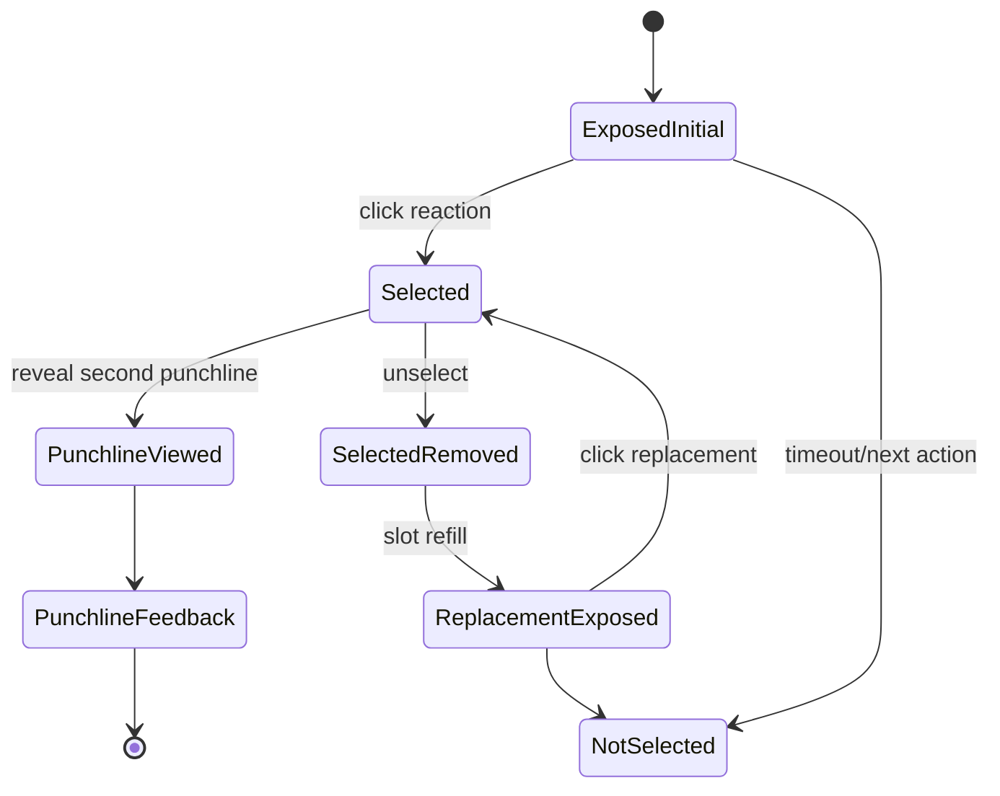
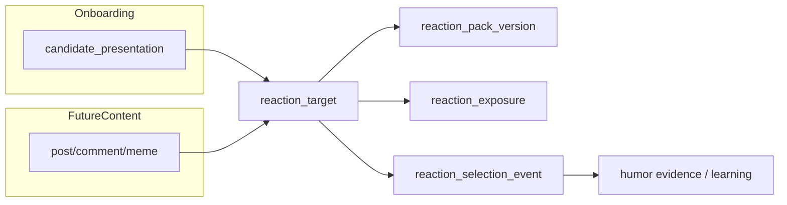
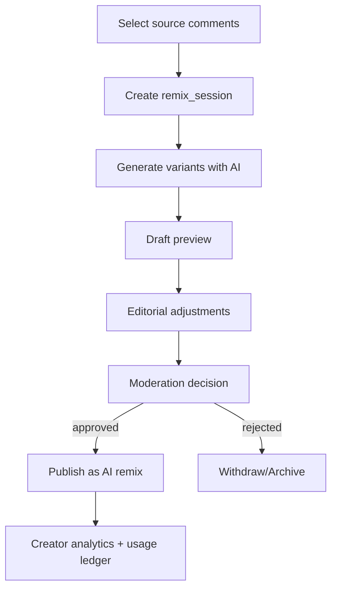

# HAIA Registration & Onboarding — Repair Plan v0.2 (analysis only)

## A. Executive Summary
Model v0.1 jest dobrym fundamentem (separacja schematów, wersjonowanie, AI metadata, Studio, learning), ale ma krytyczne luki względem nowych wymagań: **brak wielokrotnych aktywnych reakcji**, **brak śladu ekspozycji reakcji**, **niedostateczne wersjonowanie reakcji/puenty**, oraz **niespójności retencji i integralności**. Najpilniejsza naprawa to przebudowa warstwy reakcji i eventów (P0/P1), zanim rozpocznie się implementacja aplikacyjna.

## B. Sources Reviewed
1. `docs/database/haia-registration-onboarding-foundation-v0.1.sql`
2. `docs/database/haia-registration-onboarding-foundation-v0.1.md`
3. `docs/HAIA_WORKING_MEMORY.md`
4. `raport_v1.txt`
5. `docs/analysis/haia-foundational-domain-clarification-v0.2.txt`
6. `docs/features/registration/haia-user-registration-flow-v0.1.md`
7. `docs/features/registration/haia-entry-and-adaptive-humor-onboarding-v0.2.md`
8. `docs/features/registration/haia-onboarding-population-learning-addendum-v0.1.md`
9. `docs/features/registration/haia-onboarding-studio-v0.1.md`
10. `docs/features/registration/haia-onboarding-age-context-addendum-v0.1.md`
11. `TociHaia/Toci.Haia.AiIntegration.Core/haia_ai_integration_technical_report_v0.1.txt`
12. `TociHaia/Toci.Haia.AiIntegration.Core/Toci.Haia.AiIntegration.Core/Operations/GenerateCustomReactionsFromImage/GenerateCustomReactionsFromImageRequest.cs`
13. `TociHaia/Toci.Haia.AiIntegration.Core/Toci.Haia.AiIntegration.Core/Operations/GenerateCustomReactionsFromImage/GenerateCustomReactionsFromImageResponse.cs`

## C. Current Model Strengths
- Czytelny podział domen na 7 schematów.
- Dobre podstawy identity/registration (hash tokenu, external login uniqueness, legal versioning).
- Oddzielenie onboarding flow od candidate library i od AI execution.
- Rozdzielenie click reakcji vs view drugiej puenty vs feedback puenty (kierunkowo poprawne).
- Wstępny model explainability (`selection_decision` + `score_components` + `prior_sources`).
- Wstępny model Studio (review/moderation/activation/recommendation).
- Osobny learning snapshot layer pod population priors.

## D. Confirmed Defects
| # | Object | Problem | Skutek | Severity | Priorytet | Rekomendacja |
|---|---|---|---|---|---|---|
| 1 | `humor.reaction_choice` + `ux_reaction_choice_current` | Jeden `is_current_choice` na prezentację | Blokuje multi-reaction | Critical | P0 | Zmienić model current-selection na per `(presentation, reaction)` + event log |
| 2 | Brak tabeli ekspozycji reakcji | Nie wiadomo co user widział, a nie kliknął | Zafałszowane CTR i rescue analytics | Critical | P0 | Dodać `reaction_exposure` (slot, source, visible_from/to) |
| 3 | `reaction_version` bez `reaction_id` i `version_no` | Pozorne wersjonowanie | Brak linii ewolucji reakcji | High | P1 | Split na `reaction` + `reaction_version` |
| 4 | `second_punchline` jako text w reakcji | Brak stabilnego targetu dla Studio/moderation | Niespójny workflow review | High | P1 | Osobny `second_punchline` (wersjonowany) albo jawny target-level design |
| 5 | `initial_humor_snapshot` (`snapshot_version`) + `UNIQUE(onboarding_session_id)` | Wersjonowanie deklarowane, ale zablokowane | Brak realnych rewizji snapshotu | High | P1 | Usunąć unikalność per session lub przenieść current-flag do osobnej tabeli |
| 6 | `selection_decision.scoring_policy_version_id` bez FK | Luźna referencja | Utrata integralności policy lineage | Medium | P1 | Dodać FK do `learning.policy_version` |
| 7 | `candidate_presentation.scoring_policy_version_id` bez FK | jw. | jw. | Medium | P1 | Dodać FK do `learning.policy_version` |
| 8 | `onboarding.recovery_event.recovery_policy_version_id` bez FK | jw. | Niespójne analizy recovery | Medium | P1 | Dodać FK do `learning.policy_version` |
| 9 | `candidate_type` miesza format i flow role | Jedna kolumna ma 2 osie semantyczne | Trudne filtrowanie/ranking | High | P1 | Rozdzielić: `content_format` i `flow_role` |
| 10 | `candidate_media_asset` zależny od candidate_version | Słabe współdzielenie i reuse | Duplikacje, gorsza retencja praw | High | P1 | Wprowadzić stabilny `media_asset` + join |
| 11 | `candidate_classification` zbyt JSON-heavy | Ograniczone filtrowanie i indeksowanie | Słaby ranking/perf | Medium | P2 | Kluczowe osie relacyjne + JSON tylko na rzadkie tagi |
| 12 | `humor_evidence` zawiera `profession_hint` i `age_hint` jako evidence | Ryzyko potwierdzania DNA bez zachowania | Błąd epistemiczny modelu | High | P1 | Rozdzielić prior hypothesis od observed evidence |
| 13 | `humor_dimension_model_version` bez membership mapy | Nie wiadomo jakie wymiary należą do modelu | Nieauditowalne porównania | High | P1 | Dodać tabelę membership/weights |
| 14 | `identity.account_document_acceptance` i inne legalne rekordy z CASCADE od `account` | Ryzyko usuwania wymaganych prawnie śladów | Legal/compliance risk | High | P1 | Przejść na RESTRICT/tombstone/pseudonimizację |
| 15 | `audit.audit_event` deklarowany append-only, bez egzekucji | Możliwy UPDATE/DELETE | Utrata wiarygodności audytu | High | P1 | Plan uprawnień + trigger/role-only INSERT |
| 16 | Polymorphic `target_type + target_id` w Studio | Brak FK integralności | orphan records i niejawne błędy | Medium | P2 | Typed link tables dla krytycznych targetów |
| 17 | Brak modelu Sucharek 1..6 | Brak nowego requirementu | Luka funkcjonalna | High | P1 | Dodać wersjonowaną skalę suchości + rating events |
| 18 | Brak modelu Power User / remix / usage billing | Brak nowego requirementu | Luka biznesowa | Medium | P2 | Dodać minimalny power+remix domain (hooki) |

## E. Multi-Reaction Model
### E1. Założenia
- Pakiet reakcji per content target: preferencyjnie 12.
- Początkowo widoczne sloty: preferencyjnie 6.
- Możliwe wiele jednoczesnych aktywnych reakcji dla jednej prezentacji.
- Usunięcie jednej reakcji nie usuwa pozostałych.

### E2. Minimalny model danych (proponowany)
**Zmiany istniejących tabel**
- `humor.reaction_choice` → przekształcić w **state table** per `(candidate_presentation_id, reaction_pack_item_id)` z flagą aktywności i `selected_at/unselected_at`.
- usunąć constraint „jedna current per presentation”; zastąpić constraintem „jedna current per presentation+item”.

**Nowe tabele**
1. `humor.reaction_exposure`
   - `candidate_presentation_id`
   - `reaction_pack_item_id`
   - `slot_no` (1..N)
   - `exposure_source` (`initial`,`replacement`,`more`,`adaptive_reveal`)
   - `visible_from`, `visible_to`
   - `availability_state` (`visible`,`available_hidden`,`expired`)
   - `exposure_seq_no`
2. `humor.reaction_selection_event` (append-only)
   - `event_type` (`selected`,`unselected`,`reselected`)
   - `candidate_presentation_id`, `reaction_pack_item_id`, `account_id`
   - `event_order_no`, `idempotency_key`, `occurred_at`
   - `selection_context` (`from_initial_slot`,`from_more`,`from_replacement`)
3. (opcjonalnie) `humor.reaction_slot_state` (jeśli sloty są dynamicznie zarządzane jako byt)

### E3. Normalizacja wpływu
Wymagane pola dla przyszłego algorytmu:
- `selection_rank_in_presentation` (1,2,3...),
- `source_visibility_phase` (initial/replacement/more),
- `time_since_exposure_ms`,
- `is_removed_later`.

To pozwoli ważyć sygnały bez „8 kliknięć = 8x większy wpływ”.

### E4. Analytics kluczowe
- CTR per exposure phase,
- rescue efficacy initial vs replacement,
- not-clicked-but-exposed rate,
- survival time reakcji w slocie,
- multi-selection depth distribution.

### E5. Mermaid — Multi-Reaction lifecycle

## F. Dryness Rating Model
### Wariant A — Exclusivity
- Sucharek zastępuje custom reactions dla tej samej prezentacji.
- Wymaga transakcyjnej reguły: aktywny dryness blokuje nowe `reaction_choice`.
- Plusy: czysta semantyka, prostsza interpretacja.
- Minusy: mniej sygnałów humor style, mniejsza eksploracja.

### Wariant B — Coexistence
- Sucharek współistnieje z custom reactions.
- Plusy: bogatszy sygnał (co śmieszy + jak suchy materiał).
- Minusy: trudniejsza interpretacja i normalizacja.

### Rekomendacja
**B (coexistence) z polityką przełączaną** per flow/policy version.
Powód: onboarding i learning wymagają większej liczby niezależnych sygnałów, a exclusivity może zubożyć inferencję.

### Minimalny model Sucharek
Nowe tabele:
1. `humor.dryness_scale`
2. `humor.dryness_scale_level` (1..6, label, active window)
3. `humor.dryness_rating_event` (append-only)
4. `humor.dryness_rating_state` (opcjonalny current-state)

## G. Shared Reaction Engine Boundary
Rekomendacja: **shared foundation + onboarding adapter**, nie drugi niezależny silnik.

Wprowadzić neutralny target:
- `humor.reaction_target` (`target_type`, `target_id`, `context_scope`)
- onboarding mapuje `candidate_presentation` → `reaction_target`.
- feed/posty później mapują własne obiekty do tego samego target API.

### Mermaid — Reaction Engine boundary

## H. Power User Domain Impact
Minimalny zakres (bez pełnej księgowości):
- `power.subscription_plan`
- `power.plan_price_version`
- `power.account_subscription`
- `power.account_entitlement`
- `power.credit_ledger` (immutable)
- `power.ai_operation_price`
- `power.billing_period`
- `power.invoice_line_candidate`

Granice systemowe:
- HAIA: plan, entitlement, usage ledger, pricing snapshot.
- Payment operator: transakcje płatnicze.
- Invoicing system: formalna faktura i numeracja księgowa.

## I. Power Remix Model
Minimalny model:
- `remix.remix_session`
- `remix.remix_source_comment` (comment id, author id, content version, fetched_at)
- `remix.remix_generation_request` (format/style/intensity/absurdity/language/boundaries)
- `remix.remix_variant` (draft outputs)
- `remix.remix_moderation_state`
- `remix.remix_publication_state`
- `remix.remix_provenance_label` (AI remix disclosure)

Wymagane: brak podszywania się pod autorów, provenance i możliwość wycofania.

### Mermaid — Power Remix lifecycle

## J. Creator Growth Hooks
Minimalne hooki (P3):
- `creator.creator_profile_hook` (link do account, style tags, visibility)
- `creator.creator_series_hook` (series key/title/status)
- `creator.creator_metric_snapshot_hook` (agregaty)

Bez pełnego social graph, followers i marketplace na tym etapie.

## K. Existing Table Change Matrix
| Object | Action | Reason | Migration | Risk |
|---|---|---|---|---|
| `humor.reaction_choice` | CHANGE | single-current defect | M4 | High |
| `humor.second_punchline_view` | CHANGE | powiązanie z multi-select event/state | M4 | Medium |
| `humor.reaction_version` | SPLIT | brak stable identity/version lineage | M3 | High |
| `humor.reaction_pack_item` | CHANGE | slot/reveal metadata niedostateczne | M4 | Medium |
| `onboarding.candidate_presentation` | CHANGE | reaction target linkage + policy FK | M4 | Medium |
| `onboarding.selection_decision` | CHANGE | brak FK policy version | M4 | Low |
| `onboarding.recovery_event` | CHANGE | brak FK recovery policy | M8 | Low |
| `humor.initial_humor_snapshot` | CHANGE | versioning inconsistency | M6 | High |
| `onboarding.onboarding_candidate` | CHANGE | `candidate_type` semantic mix | M3 | Medium |
| `onboarding.onboarding_candidate_version` | CHANGE | rozdział format/role + version metadata | M3 | Medium |
| `onboarding.candidate_media_asset` | MERGE/SPLIT | przenieść do stable asset model | M3 | Medium |
| `onboarding.candidate_classification` | CHANGE | relacyjne osie klasyfikacji | M8 | Medium |
| `humor.humor_evidence` | CHANGE | prior vs observed conflation | M6 | High |
| `humor.humor_dimension_model_version` | CHANGE | brak membership | M6 | Medium |
| `identity.account_document_acceptance` | CHANGE | legal retention risk with cascade chain | M1 | High |
| `audit.audit_event` | CHANGE | brak append-only enforcement | M7 | High |
| `studio.editorial_review` | CHANGE | polymorphic target hardening | M7 | Medium |
| `studio.moderation_review` | CHANGE | polymorphic target hardening | M7 | Medium |
| `studio.studio_comment` | CHANGE | polymorphic target hardening | M7 | Medium |
| `studio.activation_change` | CHANGE | polymorphic target hardening | M7 | Medium |
| `studio.learning_recommendation` | KEEP/CHANGE | keep + tighten target integrity | M8 | Low |
| `ai.ai_operation_execution` | KEEP/CHANGE | keep + link pricing snapshot in power scope | M9 | Medium |
| `humor.meme_calibration_*` | DEFER | poza naprawą P0/P1 | M11 | Low |
| `humor.user_humor_inspiration*` | DEFER | poza naprawą P0/P1 | M11 | Low |

## L. Missing Constraints and Foreign Keys
### Brakujące FK (potwierdzone)
1. `onboarding.selection_decision.scoring_policy_version_id` → `learning.policy_version.policy_version_id`.
2. `onboarding.candidate_presentation.scoring_policy_version_id` → `learning.policy_version.policy_version_id`.
3. `onboarding.recovery_event.recovery_policy_version_id` → `learning.policy_version.policy_version_id`.

### Luźne referencje uzasadnione (czasowo)
- `studio.* target_type + target_id` (tymczasowo, ale do utwardzenia typed linkami).
- `ai.ai_generation_target.target_id` (generyczny target; wymaga boundary contract i walidacji aplikacyjnej).

### Relacje do rozważenia przez `ALTER TABLE` w naprawie
- powiązanie `reaction_target` z onboarding presentation,
- powiązanie `dryness_rating_event` z presentation/target,
- powiązanie power ledger entries z `ai_operation_execution`.

## M. Versioning Repair
- Candidate: utrzymać `candidate` + `candidate_version`; doprecyzować `significant_change_policy`.
- Media: dodać `media_asset` (stable) + `candidate_version_media` (join + role).
- Reaction: dodać `reaction` + `reaction_version(version_no)`.
- Reaction pack: utrzymać `reaction_pack` + `reaction_pack_version`; dodać jawne reguły active/scheduled.
- Second punchline: dodać `second_punchline` + `second_punchline_version` **lub** minimum `second_punchline_id` w reaction_version.
- Humor DNA model: dodać `humor_dimension_model_member` (dimension, weight, bounds, status).
- Snapshot: usunąć konflikt unikalności i dopuścić rewizje snapshotów.
- Prompt/policy: utrzymać, dołożyć spójne FK i active-window constraints.

## N. Prior vs Evidence Repair
Rozdzielić 5 warstw:
1. Age prior hypothesis.
2. Profession prior hypothesis.
3. Population priors (global/cohort).
4. Individual observed behavioral evidence.
5. Confirmed Humor DNA evidence.

Reguła: **prior nie może sam potwierdzić wymiaru DNA**. Potwierdzenie wymaga co najmniej jednego observed evidence typu behavior/reaction/punchline feedback.

## O. Retention and Deletion Repair
- Legal acceptance: nie kasować CASCADE z kontem; RESTRICT/tombstone + pseudonimizacja konta.
- Age eligibility: retencja legalna, separacja od personalization.
- Optional contexts (age/profession): usuwalne i wersjonowane soft-delete.
- Interaction events: retencja konfigurowalna + pseudonimizacja po usunięciu konta.
- AI outputs: retencja konfigur. per output_type (structured raw krócej).
- Audit: append-only, długa retencja, dostęp restrykcyjny.

## P. Audit Integrity Plan
Docelowo:
1. DB role `audit_writer` (INSERT only).
2. Brak UPDATE/DELETE dla ról aplikacyjnych.
3. Trigger blokujący UPDATE/DELETE na `audit.audit_event`.
4. Wstawienia wyłącznie przez dedykowaną ścieżkę serwisową.
5. Rotacja/archiwizacja przez proces administracyjny, nie ad-hoc DML.

## Q. Proposed Tier Reclassification
### New Tier 1 (mniej, bardziej atomowo)
- identity core + legal acceptance,
- onboarding session/step,
- candidate/version,
- reaction pack/version,
- reaction exposure + selection events,
- candidate feedback,
- initial working DNA minimum,
- dryness rating.

### New Tier 2
- Studio governance,
- AI persistence,
- policy/cohort definitions,
- prediction/outcome and performance snapshots,
- prior/evidence hardening.

### New Tier 3
- Power subscription/billing hooks,
- Power remix,
- creator hooks,
- optional calibration expansion.

## R. Proposed Atomic Migration Plan
M1. Identity and Registration Repair (legal retention + email/account invariants).
M2. Context and Onboarding State (age/profession split hardened).
M3. Shared Reaction Foundation (reaction identity/versioning, media asset normalization, candidate format/role split).
M4. Multi-Reaction Exposure and Selection (core P0).
M5. Dryness Rating (scale + events + policy mode).
M6. Humor DNA Evidence Repair (prior vs observed + snapshot versioning + model membership).
M7. AI and Studio Integrity (FK hardening + polymorphic target mitigation + append-only audit controls).
M8. Population Learning (classification normalization + recovery policy FK + cohort safeguards).
M9. Power Subscription and Usage (plan/subscription/ledger/pricing snapshot).
M10. Power Remix (session/source comments/variants/provenance/moderation state).
M11. Optional Calibration and Creator Hooks.

## S. Data Migration Risks
- Przejście `reaction_choice` do multi-select może wymagać konwersji current-state do event-history.
- Split `reaction_version` -> `reaction` + `reaction_version` wymaga mapowania stable ids.
- Zmiana retencji legalnej i usunięcie CASCADE wymaga nowej strategii usuwania kont.
- Snapshot refactor (session uniqueness) wymaga decyzji o „current snapshot pointer”.
- Polymorphic target hardening może wymagać migracji rekordów review/moderation.

## T. Open Product Decisions (max 25)
1. Czy końcowo Sucharek ma być domyślnie exclusive czy coexistence?
2. Czy tryb Sucharek ma być polityką per flow/version?
3. Ile maksymalnie reakcji aktywnych user może mieć per content?
4. Czy replacement slot ma być deterministyczny czy adaptacyjny?
5. Czy exposure slot timeout ma znaczenie analityczne?
6. Definicja „real exposure” (min visible ms?).
7. Czy reaction selection może być batch (multi-click) czy strict sequential?
8. Finalna definicja Reaction Rescue Rate.
9. Granica pomiędzy `reaction` a `second_punchline` jako bytem.
10. Czy snapshot może być wielokrotnie rewidowany per session?
11. Jak oznaczać „published snapshot” i immutability?
12. Minimalny zestaw relacyjnych osi klasyfikacji kandydata.
13. Progi minimalnej liczebności kohort publikowalnych.
14. Maksymalna waga prioru kohortowego na starcie.
15. Heurystyka cohort mismatch (threshold i moment).
16. Czy legal acceptance ma być nieusuwalne czy pseudonimizowalne?
17. Retencja `source_ip/user_agent` dla acceptances.
18. Czas retencji raw AI structured output.
19. Czy `ai_generated_output` może zawierać redakcyjnie zanonimizowane payloady?
20. Granica odpowiedzialności między HAIA billing a system fakturowy.
21. Czy kredyty są miesięcznie resetowane czy przenoszone?
22. Czy pricing snapshot jest per request czy per session?
23. Jak modelować provenance gdy komentarz źródłowy został usunięty?
24. Które targety Studio wymagają typed links już w M7?
25. Czy creator hooks mają być osobnym schematem czy w `power/remix`?

## U. Recommended Next Atomic Task
**Jeden następny atom:**

> **M4 — Multi-Reaction Exposure and Selection (P0)**

Zakres atomu:
- naprawa `reaction_choice` pod wiele aktywnych wyborów,
- dodanie modelu ekspozycji reakcji,
- dodanie append-only selection events,
- utrzymanie kompatybilności onboarding flow,
- przygotowanie pod Sucharek i przyszły shared reaction engine.
